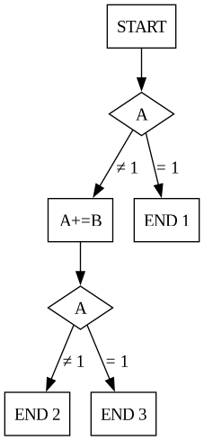
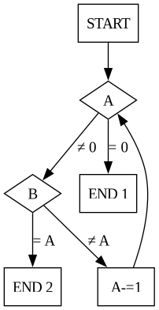
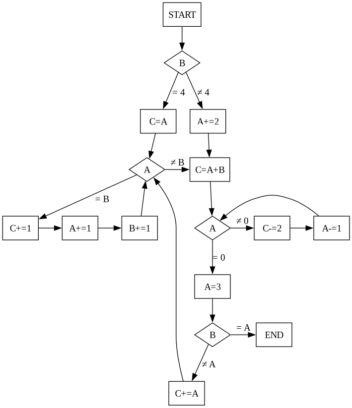

# L'usine à chaudrons : une activité sur le test
Nous présentons dans cette section une activité utilisant le modèle du chaudron magique pour présenter le concept de jeu de test et de branch coverage.
Les "points pédagogiques" sont répartis tout le long des explicatoins, il faudra en pratique les présenter en fin d'activité.

Speech introductif:
Vous êtes responsable d'une usine de chaudrons.
Les alchimistes du monde entier ne peuvent plus attendre votre dernière création: le chaudron le plus puissant jamais créé.
Mais un tel chaudron n'est pas sans danger, pour que les alchimistes puissent l'utiliser en toute sécurité, **vous devez d'abord vous assurer qu'il est impossible que le chaudron explose**.

Vient en suite une explication du concept de chaudron, comme présenté dans la section précédente.
Dans notre jeu, les **bugs** surviennent sur les arêtes du GFC (Graphe des Formules du Chaudron) / CFG en anglais (Chaudron's Formulas Graph).

Dans un premier temps, on fait manipuler le chaudron, en traçant avec un feutre (directement sur le graphe) le chemin pris en fonction de l'état initial (les différents ingrédients du chaudron).
Les ingrédients sont ensuite placés dans un coupelle et constituent un **test**.
> Point pédagogique : Un **test** est un ensemble d'ingrédients (de paramètres). Un test permet de couvrir une certaine partie du CFG.

On cherche ensuite à établir d'autre tests, dans d'autres coupelle, de sorte à couvrir toutes les arêtes du CFG.
On prendra soin de colorier les arêtes prises par chaque jeu de test.
> Point pédagogique : Un **jeu de tests** est un ensemble de tests. Le **coverage** d'un jeu de test est la proportion d'arêtes explorées par ce jeu de test.

Plusieurs CFG sont disponibles et visent à illustrer différents points

### Premier chaudron
On présente dans ce premier exemple le fonctionnement de base du chaudron, sans boucles et avec seulement deux conditions.
Les deux blocs possèdent la même conditions et accentuent le fait que le chaudron change d'état.
Un des états est accessible par une unique entrée.
```c
int cfg1(int x, int y) {
 if(x == 1) {
     return;
 } else {
     x += y;
     if(y == 1) {
         return;
     } else {
         return;
     }
 }
}
```





### Deuxième chaudron
Dans cet exemple on introduit la notion de boucle.
Il s'agit d'un simple décrément de A jusqu'à B.
Si A < B dans l'état initial, A décroit jusqu'à zéro.
On peut pousser les apprenant à commencer l'execution avec beaucoup de A pour qu'ils comprennent ce qu'il se passe. On prendra soin de considérer une entrée qui n'entre jamais dans la boucle

```c 
void cfg2(int x, int y) {
    while(x) {
        if(x == y) return;
        else x--;
    }
    return;
}
```




### Autres Chaudrons
Nous avons élaboré un troisième chaudron nettement plus complexe que les deux précédents.
Ce chaudron présente des boucles imbriquées de grande taille, potentiellement infinies.
On peut aussi tomber face à des opérations impossibles (du type enlever un oeil alors qu'il n'y en a pas dans le chaudron).
On peut aussi considérer l'ajout de code mort (dans ce cas, il est impossible d'avoir 100% de coverage).

```c
int cfg3(int x, int y, int z) {
 if(x != 4) {
     z += 2;
 } else {
     y = z;
lbl:
     while(z == x) {
         y += 1;
         z += 1;
         x += 1;
     }
 }
    
 y = z + x;
 while(z != 0) {
     y -= 2:
     z -= 1;
 }
    
 z = 3;
 if(x == z) return;
 else {
     y += z;
     goto lbl;
 }
}
```



## Pourquoi c'est de l'informatique ?

Lorsque des humains écrivent des programmes informatique, on veut vérifier que le programme ne contient pas d'erreurs. 
En fait le chaudron est un programme, et les ingrédients de base sont des tests. Si on a plusieurs tests, on appelle ça un jeu de tests.

Idéalement, on voudrait que ces tests passent par le plus le cas possibles, cela nous permet de tester un maximum de possibilités dans notre programme. 
Cette idée s'appelle le coverage et évalue la qualité d'un jeu de tests.
Ainsi, quand on modifie notre programme, par exemple pour le rendre plus rapide, on pourra s'assurer que ces tests donnent toujours le même résultat et donc que notre programme est toujours correct.
